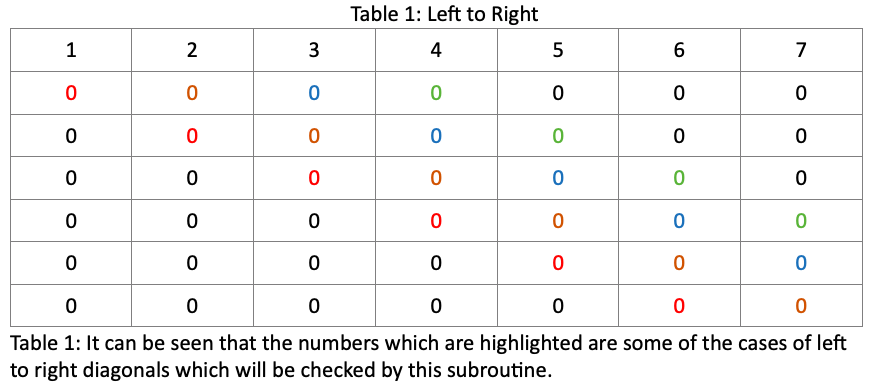
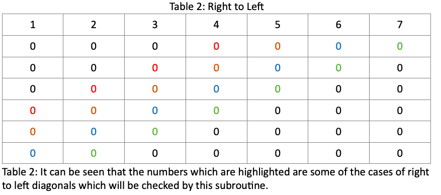
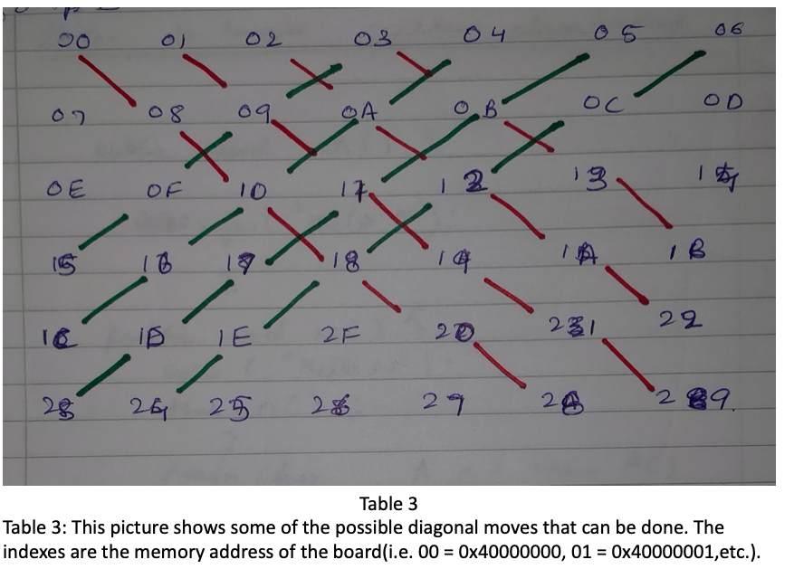

Developed in ARM Assembly Language
connect4COMPUTER - Play against Computer
connect4 - MULTIPLAYER

# Introduction
Our aim is to make a game of Connect 4. The board has 6 rows and 7 columns. To do this, following functions have to be performed:
1)	Initialization of board
2)	Make a move
3)	Printing the board
4)	Checking for a winning move
5) 	Computer as a player

# INITIALIZATION
The board is initialized at the very start of the program by storing ‘0’ at all the indexes of the board. It takes the first index of the board and store ‘0’ to it. Then it increments the index and a loop is made till all the 42 values are ‘0’.

# MAKE A MOVE
All the values stored are byte sized. Board is initialized at the position 0x40000000. To make a move, firstly user is asked to input a column number in the main class. A switch is created in the main class which specifies whether player ‘R’ or player ‘y’ is playing.

A subroutine named MOVE has been made. In the MOVE subroutine, firstly the character (user given column number) is converted from ASCII code to number. 

Then this offset is added to the BOARD address. The value of that address is loaded. If it is not ‘0’, then it prints that the column is full and asks for a different column number.

If it is ‘0’, it adds 7 (offset) to the of index (meaning going to next row) and checks if it is 0. If that is 0 too, it checks the further one till it reaches the bottom. If all are 0, then it stores ‘R’ or ‘Y’ to the bottom most row of that column. Otherwise it stores ‘R’ or ‘Y’ in the previous row.

# PRINTING THE BOARD
Firstly, the string of numbers from 1-7 is printed as a reference for the columns. Secondly, address of board is called. Board is treated as a 2-D Array. The first index is printed using a put function. Then the column is incremented by one and is then the second index is printed. Meanwhile, an overall counter (named as index in code) is recording the number of times the column is incremented. 
When the first row, consisting of 7 columns, is printed the cursor goes to the next line and resets the column counter to 0. This process goes on till the overall counter is equal to 42 i.e. all the 42 values are printed.

# CHECKING A WINNING MOVE
A player can win by 3 ways. If the coins line up vertically, horizontally or diagonally. These subroutines are included in the code by the name of CHECKV, CHECKH and CHECKD. 

### CHECKV- 
In this subroutine, firstly, the first index (1,1) of the board is selected. It checks if it is ‘R’ or ‘Y’.
If it is neither ‘R’ nor ‘Y’, then increments the index and the second index (1,2) of the board is selected. Same procedure is followed till the last index (6,7) of the board is selected.

If at any index, ‘R’ is stored it checks if it’s a winning move. When the first ‘R’ is found it increments the length by 1. Then it increments the index by adding 7 to the index, i.e. going to the next row, and checks if it’s ‘R’ too. If it is ‘R’, it increments length by 1. If the length becomes 4, the player wins, and a string is outputted telling the player(s) that ‘R’ won. If at any index vertically ‘R’ is not present, then it resets the length by 0 and checks for the next row.

Same procedure takes place for the ‘Y’ coin.

### CHECKH
Similar to the CHECKVsubroutine, the first index is selected and checks if ‘R’ or ‘Y’ is stored.
If not, then the index is incremented.

If at any index ‘R’ is stored it checks if it’s a winning move. When the first ‘R’ is found it increments the length by 1. Then it increments the index by adding 1 to the index and checks if ‘R’ is stored in that index too. 
If no, it resets the counter and loops back to checking for the next index.
If yes, it increments length by 1 and follows the same procedure to check if the next row has ‘R’ too. 
If the length becomes 4, the player wins, and a string is outputted telling the player(s) that ‘R’ won.

Same procedure takes place for the ‘Y’ coin.

### CHECKD
This subroutine starts at the first index (1,1) of the board. It checks for ‘R’ or ‘Y’. 
If none of these characters is found, it increments the index by 1. 
However, unlike CHECKVand CHECKD, the index is incremented till the index (4,1).
It does not go below the fourth row, as length of 4 cannot be obtained diagonally after the 4th row. 

If ‘R’ character is found, then it increments the length by 1. Then it checks for 2 cases.
Checks for diagonals left to right.
Checks for diagonals right to left.

For checking the diagonals left to right, it increments the index by 8. So, if the first ‘R’ was found at index (1,1), it jumps to index (2,2). It checks for the character ‘R’ and if found the length is again incremented by 1 and index is incremented by 8 (i.e. changing the index from 2,2 to 3,3). If the length becomes 4, the player wins, and a string is outputted telling the player(s) that ‘R’ won.

  

Otherwise, it checks for the second case. Second case is checking for diagonals right to left.
 For checking the diagonals right to left, it increments the index by 6.
 So, if the first ‘R’ was found at index (1,4), it jumps to index (2,3). It checks for the character ‘R’ and if found the length is again incremented by 1 and index is incremented by 6 (i.e. changing the index from 2,3 to 3,2). If the length becomes 4, the player wins, and a string is outputted telling the player(s) that ‘R’ won.

These both cases are checked for the ‘Y’ coin.

   

  
### COMPUTER PLAYER
In this subroutine, the computer starts from the first index. It checks for ‘R’ key which is the player’s key. If it is not found it moves on to next index.
When the computer finds the ‘R’ key it checks for the length of the key. The length can be in a vertical direction or a horizontal direction.
First the computer checks for the horizontal condition. Just like the subroutine CHECKH it finds the length by incrementing the index and seeing if ‘R’ key is stored or not. Although, unlike CHECKHit finds where the length is 3. When it finds that the length is 3, it blocks the move by putting a ‘Y’ key in that column. 

If it did not find any horizontal pattern, computer moves to looking for vertical pattern.

Like the subroutine CHECKV it finds the length by incrementing the index and seeing if ‘R’ key is stored or not. Again, unlike CHECKV it finds where the length is 3. When it finds that the length is 3, it blocks the move by putting a ‘Y’ key in that column. 

Also, in the main class a counter has been made which starts from first column and goes to the last column. When it reaches the last column, it resets back to the first column.
When the computer cannot find any pattern, the key is dropped in the column which is equal to the counter.

All the cases have been checked and verified for possible errors. 

